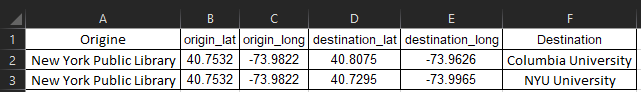
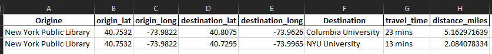
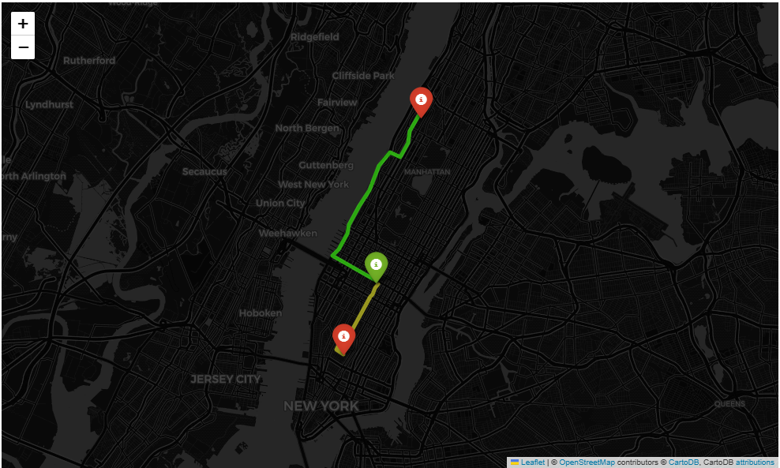

# PathFinder
Estimating Distance and Travel Time for Multiple Pairs of Origins and Destinations Considering Transportation Mode, Departure Time, Traffic Conditions, with Route Visualization on Map

## Summary
Welcome to this awesome repository! Inside, you'll find a Python code named PathFinder_git.ipynb, which is capable of estimating travel time and distance between any origin and destination by simply providing their coordinates as inputs. This nifty code takes into account various routing parameters like traffic status, departure time, and transportation mode (such as driving or biking).
But here's the really cool part: this code can handle multiple origin-destination pairs by reading their coordinates from an Excel file. The result? Another Excel file, aptly named "RouteEstim," containing a table that showcases the estimated travel time and distance for each pair. This feature proves invaluable when dealing with large datasets that include numerous origin-destination combinations.
As if that weren't impressive enough, the code goes a step further by visualizing the discovered routes and markers on an interactive map, thanks to the powerful folium library. Get ready to witness your data come to life!
To get started, head over to the data folder, where you'll find a convenient input table template called "InputTable.xlsx." Don't wait any longer; let's embark on this exciting journey of travel estimation and visualization!
### Input table: 


## Google Maps API 
Get ready to experience the power of the Google Maps API! This script leverages the incredible capabilities of the Google Maps API and the user-friendly googlemaps library to perform routing and estimations.
By utilizing the gmaps.directions() function, this script effortlessly conducts routing calculations, providing accurate travel directions and estimations. It's like having a personal navigator right at your fingertips!
If you don't already have a Google Maps API, worry not! Obtaining a free API key is a breeze. Simply visit https://console.cloud.google.com and follow the instructions to get your hands on the API key. Oh, and don't forget to activate the "Direction API" in your Google Cloud portal for seamless functionality.
With the Google Maps API by your side, you'll unlock a world of possibilities for routing and estimations. Let's embark on this exciting journey and harness the power of location-based intelligence!
### gmaps.directions() in the scripts:
```python 
    directions = gmaps.directions(
        origin,
        destination,
        mode = mode,
        traffic_model=traffic_model,
        departure_time=departure_time
    )
 ```
 
## Case Study and Results
As an example, I put the script to the test by finding the distance and driving travel time between Columbia University and NYU to the NY Public Library. Check out the results right here:
### Results: 




